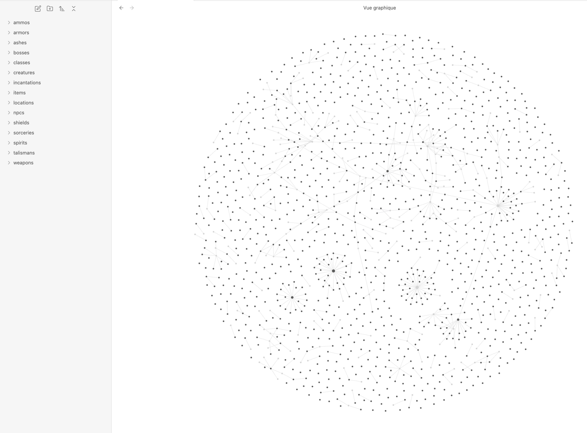
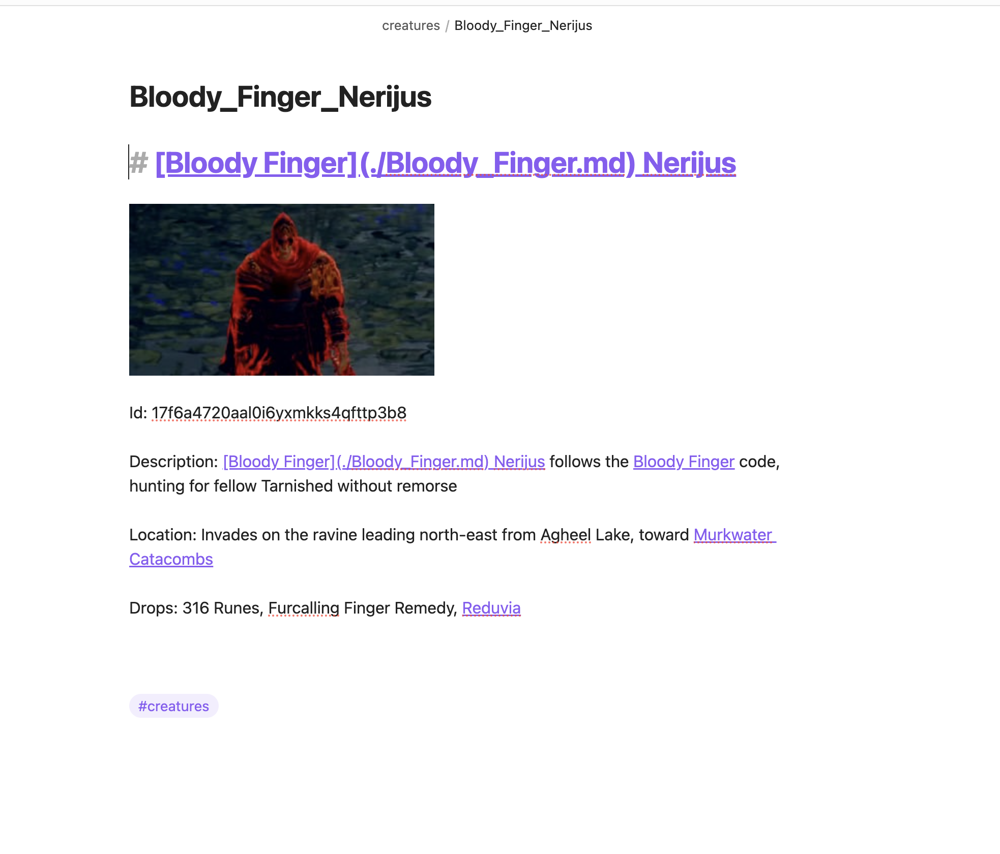
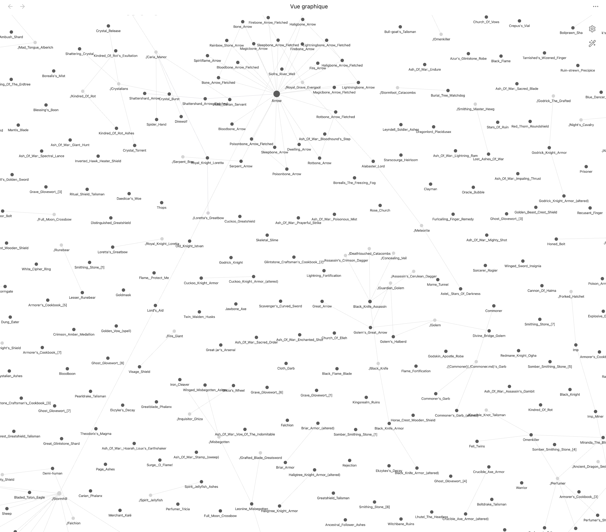

# Elden-ring-second-brain





To install dependencies:

```bash
bun install
```

To run:

```bash
bun run index.ts
```
and :

```bash
bun run linked.ts
```

## importe dist on new Obsidian vault
https://obsidian.md/


### Credits

Thanks to [deliton](https://github.com/deliton) for the [Elden Ring API](https://github.com/deliton/eldenring-api)